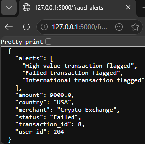
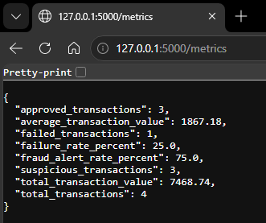
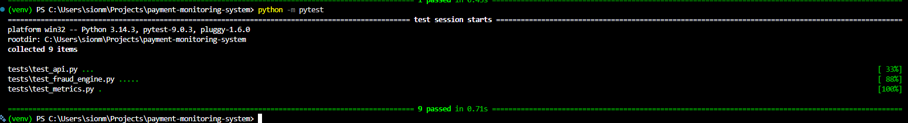
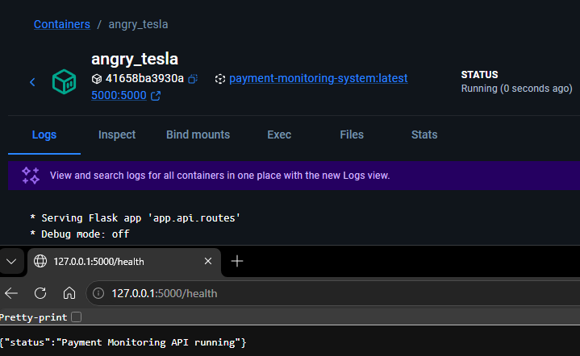

# Payment Transaction Monitoring System

## Overview

This project is a backend payment transaction monitoring system built using Python, Flask and SQLAlchemy to simulate functionality commonly used in modern fintech and payment platforms.

The application processes payment transactions through REST API endpoints, stores transaction data in a SQLite database and performs rule-based fraud detection checks on suspicious activity such as high-value, failed and international transactions.

Additional features include operational monitoring metrics, CSV report generation, structured logging, automated testing using Pytest and Docker containerisation for portable deployment.

I built this project to strengthen my understanding of backend software engineering concepts including API development, databases, testing, monitoring and deployment workflows in a more realistic, real-world environment.

## Features

- REST API transaction processing
- SQLite database integration
- Rule-based fraud detection engine
- Fraud alert monitoring endpoint
- Operational metrics reporting
- CSV report export functionality
- Structured logging and error handling
- Automated testing with Pytest
- Docker containerisation

## Technologies Used

| Technology | Purpose |
|---|---|
| Python | Backend development |
| Flask | REST API framework |
| SQLAlchemy | Database ORM |
| SQLite | Transaction storage |
| Pytest | Automated testing |
| Docker | Containerisation |
| Git & GitHub | Version control |
| Postman | API testing |

## Project Screenshots

### Fraud Detection Endpoint



---

### Operational Metrics Endpoint



---

### Automated Test Results



---

### Docker Container Running



## Key Learning Outcomes

Through this project I strengthened my understanding of:

- Backend API development
- Database integration and transaction storage
- Fraud detection and monitoring logic
- Structured error handling and logging
- Automated testing using Pytest
- Docker containerisation and deployment workflows
- GitHub version control and documentation practices

## Future Improvements

Potential future enhancements include:

- JWT authentication
- PostgreSQL integration
- CI/CD pipeline automation
- Cloud deployment
- Real-time monitoring dashboard
- Machine learning fraud detection

## System Architecture

```text
Client Request
      ↓
REST API (Flask)
      ↓
Fraud Detection Engine
      ↓
Transaction Service
      ↓
SQLite Database
      ↓
Monitoring & Reporting


